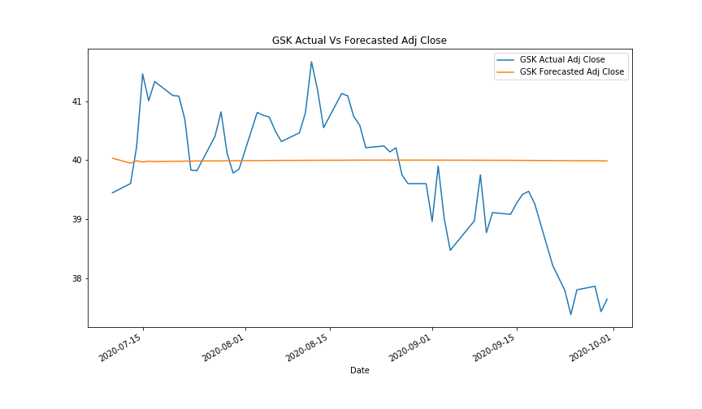
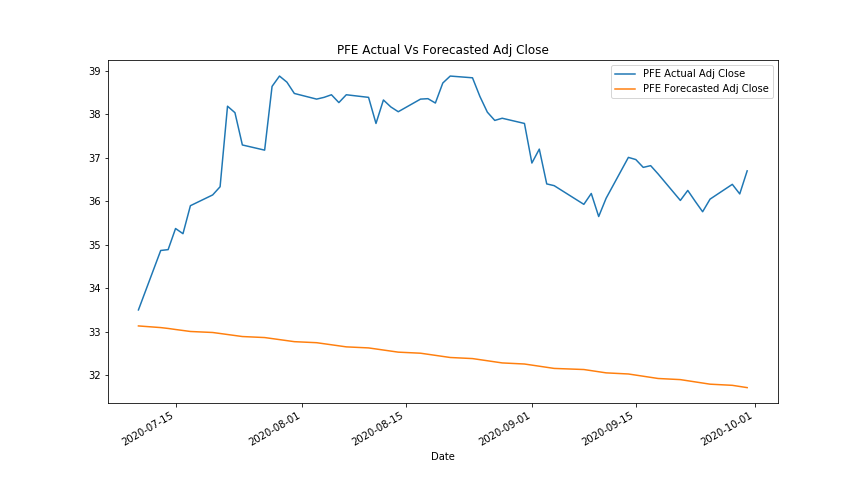
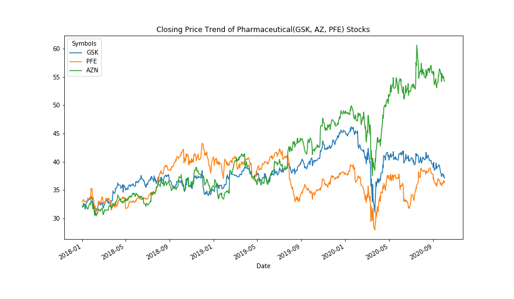
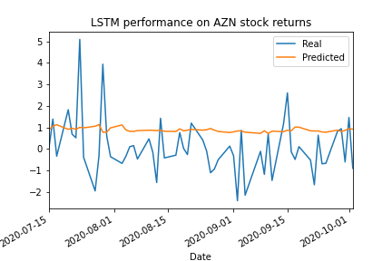
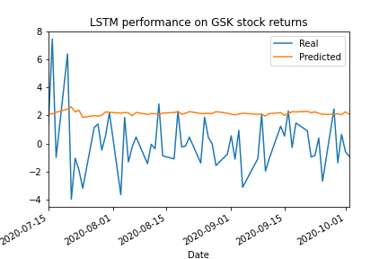
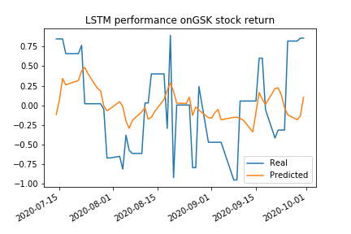
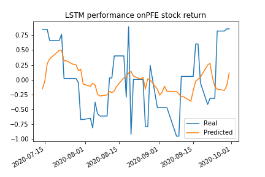
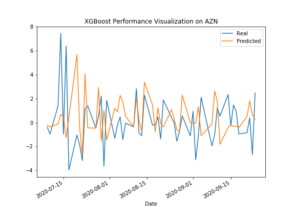

# UofT-Fintech: Machine Learning
## Impact of Donald Trump tweets on pharmaceutical stocks during Covid-19

## 1. Summary
The recent pandemic has affected all of us in various ways both big and small. However, there are certain individuals in our world who can create a big impact on the outcome of this situation, with just their words. One such individual is the President of the United States.

As we all know, Mr. Donald Trump is very active on a popular social media site called Twitter. Even if we are not on the site ourselves, we have all heard of his opinions through his tweets.

The relationship between President Donald Trump's Tweets and the stock market has been documented by many research companies:
* In September 2019, [a JPMorgan bot analyzed 14,000 Trump tweets and found their increasingly sharp impact on markets](https://markets.businessinsider.com/news/stocks/jpmorgan-volvefe-index-on-impact-of-trump-tweets-on-market-volatility-2019-9-1028508499#)
* Bank of America Merrill Lynch also reported that [on days when President Trump tweets a lot, the stock market falls](https://www.cnbc.com/2019/09/03/on-days-when-president-trump-tweets-a-lot-the-stock-market-falls-investment-bank-finds.html)

Our goal is to analyze if Donald Trump’s tweets about the recent pandemic over the last year, have  affected the stock prices of the following 3 pharma companies:
* Pfizer
* GSK
* Astrazeneca

Using this analysis, we can predict if the US President’s social media presence has any impact on the market.

## 2. Project Approach
Using the closing prices of the 3 pharmaceutical companies and Donald Trump's tweets from Jan to Sept 2020, the following Machine Learning models were used to calculate sentiment analysis and daily return predictions:

   * Sentiment Analysis using NLP (for tweets)
   * Time Series Forecasting
   * LSTM Model
   * XGBoost Model

## 3. Sentiment Analysis using NLP
In order to use the sentiment from Trump's Tweets as a feature in our machine learning models, we were required to do complete three tasks:

1. Extract Trump's Tweets from Twitter
2. Extract tweets related to the pandemic (called 'Pandemic Tweets')
3. Assign a sentiment score related to the Pandemic Tweets

#### 3.1 Part 1 - Extract Trump's Tweets from Twitter (TwitterScraper.ipynb)

There are a number of python libraries available to extract tweets from twitter. Twitter's own library called 'Tweepy' allows users to extract tweets for the last 7 days. Since our models required data from January 1, 2020 to Sept 30, 2020, we needed a more robust library to gather data from farther back.

We explored using the library GetOldTweets3 but unfortunately Twitter changed their endpoints approximately four days prior to the start of our project. This change caused the library, along with a host of others libraries to become unusable. In order to obtain the data, we scraped Twitter using Selenium. 

The resulting code was then processed with BeautifulSoup.

#### 3.2 Part 2 - Finding 'Pandemic Tweets' (sentiment_analysis.ipynb)

A Regular Expression (Regex) pattern was used to identify tweets containing one of the following strings of characters:
* china
* flu
* vaccine
* covid
* corona
* chinese
* pharma

Tweets containing one or more of these strings of characters were flagged as 'Pandemic Tweets' to be extracted, analysed, and used as a feature in our machine learning models.

#### 3.3 Part 3 - Assigning a Sentiment Score

'Pandemic Tweets' were then assigned a sentiment score using the VADER sentiment analyzer. 

Since Pandemic Tweets only occured on approximately 46% of the days between Janaury 1st and September 30, 2020, we were required to fill the missing days with data to align with the availability of stock data. As such, we chose to forward fill the previous day's sentiment score into days which were missing data.

Weekends and non-trading days were then dropped to align with the availability of stock data.

The data was then exported to a CSV file to be used in the machine learning models.

#### 3.4 *Analysis of Preliminary Findings*

The main goal of these notebooks was to create a CSV file with Trump's sentiment analysis for use in our machine learning models. However, there are some fun preliminary findings.

* Trump only Tweeted about the pandemic 46% of the time:

* In total, of trump's 1881 tweets between January 1 and September 30, 2020, only 11% of his Tweets were 'Pandemic Tweets'
* Analysis of Trump's sentiment scores in Pandemic Tweets between January 1 and September 30, 2020 show that he is becoming increasingly negative:

Overall the POTUS does not seem to be doing to great. Please view the machine learning notebooks for further analysis of the impact of Pandemic Tweets on companies stock prices who are developing a vaccine.

## 4. Time Series Forecasting
In the "Time_Series_ARIMA_2020" notebook, historical stock prices, volume data was extracted from YahooFinance API for three top pharmaceutical companies namely GSK, Pfizer and AstraZeneca from 2018 to Sep 2020. Time series modelling ARIMA was used to determine if past values can predict the future stock prices for these companies.
We created time series models and forecasted the movement of the stock prices as outlined below:
1. Decomposition using a Hodrick-Prescott filter (decomposed the settle price into trend and noise).
2. Selected variable based on stationarity (adjusted closing price versus percent change in adjusted closing price) 
3. Autocorrelation & Partial Autocorrelation Analysis
4. Forecasted the % in stock price using an ARIMA model by takeing the data from 1 Jan 2020 to 9 July 2020
4. Derived the forecasted values for next 58 days i.e. for the period 10 July 2020 to 30 Sep 2020, using the forecasted values from the model
5. Compared the actual versus forecasted values from July 10 2020 to 30 Sep 2020
6. Calculated the average of absolute difference in forecasted versus actual stock prices 
Time series analysis and modelling helped answer the following questions:
1. Based on the time series analysis, it was determined that the model is good in predicting stock prices for shorter window(1-2 weeks) and then it fails. We built a supplementary ARIMA model "Time_Series_Supplmentary_Model" with longer historical data (Jan 2018 to June 2020) to rule out the lesser data points issue. Here are the results of comparisons:
 

2. Based on the model evaluation as outlined in the table below, we do not feel confident in using these models for trading  

### *Exploratory Data Analysis*
Overall trend was observed for the stock prices and there was drop in stock prices across pharmas due to COVID-19 in April 2020.  
 
The stock data was merged with the sentiment score from Donald Trump's tweets and basic checks such as scatter plots and correlations between Volume, compound scores and percent change in adjusted closing prices for each of the pharamceutical. There was no strong correlation observed between variables (refer to "EDA" notebook) 

## 5. LSTM Model
Long short-term memory (LSTM) is an artificial recurrent neural network (RNN) architecture, used in the field of deep learning. LSTMs are very powerful in sequence prediction problems because they’re able to store past information. This is important in this initiative, because the previous price of a stock is critical in predicting its future price.

The LSTM models were run on the pharmaceutical stocks to generate a baseline to compare performance against other machine learning models:
   1. LSTM model where the stock price was used both as a feature and as a target.
   2. LSTM model where volume was used as a feature and price as a target.
   3. LSTM model where daily returns (based on stock price) was used both as a feature and target. Daily returns was used to prevent overfitting of the models.

The LSTM model with daily returns was used as the baseline for comparison. Volume was excluded as a feature as it might skew the analysis of the prediction of returns when compared with a LSTM model where the sentiment scores are applied as feature. 

The last phase was to create a LSTM model with 2 features, daily returns and compound sentiment score. This was done to determine the impact of the Donald Trump twitter feeds related to Covid on daily return prediction and the future application as an input to predict changes in stock price.

### *LSTM Summary of Findings*
   * LSTM performance was measured by running a model with  daily returns where returns was used as both feature and target vs performance of another LSTM model where returns and sentiment score was used as feature:  
      * AZN LSTM model for 1 feature (returns) vs 2 features (returns and sentiment score):
        
         

      * GSK LSTM model for 1 feature vs 2 features (incl sentiment score):   
              
          

      * PFE LSTM model for 1 feature vs 2 features (incl sentiment score):  
        
        

   The baseline model where daily returns was used, performed much worse than expected.  

   * Summary of loss values for LSTM baseline model with daily returns set as feature and target:
      * AZN: 0.0672
      * PFE: 0.03746
      * GSK: 0.05438

   * The LSTM model with a single feature performed much worse than LSTM model with 2 features. This can be due to the small dataset size. LSTM models have been designed to use on larger data sets.

   * For LSTM models with 2 features where sentiment compound score is a feature, the performance seem to be much better, however, the sentiment compound score cannot be used as a indicator of price performance.

   * Further investigation is needed to understand the difference in the output of the real price values in the baseline model vs the model with 2 features as well as the performance of prediction of baseline model.

## 6. XGBoost Model

XGBoost is a decision-tree-based ensemble Machine Learning algorithm that uses a gradient boosting framework. In prediction problems involving unstructured data (images, text, etc.) artificial neural networks tend to outperform all other algorithms or frameworks. However, when it comes to small-to-medium structured/tabular data, decision tree based algorithms are considered best-in-class right now. 

Since its introduction, this algorithm has not only been credited with winning numerous Kaggle competitions but also for being the driving force under the hood for several cutting-edge industry applications. 

The two reasons to use XGBoost are mainly:

* Execution Speed.
* Model Performance.

The XGBoost models were run on the pharmaceutical stocks to generate the following:
   1. XGBoost model where daily returns (based on stock price) was used both as a feature and target to behave as a baseline for performance comparison with other machine learning models.
   2. XGBoost model with 2 features, daily returns and compound sentiment score. This was done to determine the impact of the Donald Trump twitter feeds related to Covid on daily return prediction and if it can be used as an input to predict changes in stock price.

### *XGBoost Summary of Findings*
   * Comparing XGBoost performance on daily returns where returns was used as both feature and target vs performance where returns and sentiment score was used as feature:  
        
        

        
        

        
        

   * Model evaluation scores:
       XGBoost with 1 feature: 1.275
       XGBoost with 2 features: 0.423

## 7. Conclusion
When comparing performance of various machine learning models, the XGBoost model performance is better than LSTM and Arima.

We feel that we do not have significant evidence to conclude that Trump's tweets impacts stock prices of GSK, Pfizer, AstaZeneca.

## 8. Technical specifications

Jupyter notebooks were used for all analysis.  

### Installation instructions for XGBoost:
   `conda install -c anaconda py-xgboost`  
   (Inside the jupyter notebook do the following:
   `!pip install xgboost and import xgboost as xgb`)

### Libraries required for TwitterScraper:
* requests
* BeautifulSoup
* Selenium (note: you will need a webdriver for FireFox)

# File locations:
Starter files can be located under:
* [Sentiment Analysis](./Code/Sentiment_Analysis)
* [Arima - Time Series](./Code/Time_Series)
* [LSTM Code](./Code/LSTM)
* [XGBoost](./Code/XGBoost)

Data files can be located under:
* [Data](./Data/)

Images can be located under the following folder:
* [Images](./Images)

Presentation can be found at the following link:
* [Project_Presentation](https://prezi.com/ynxwicl_iz4a/edit/?auth_key=zxgs5rm&follow=x09-anuwh_ai#59_30863873)

____

