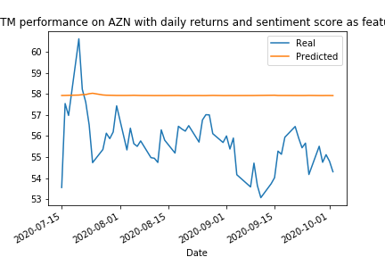

# UofT-Fintech-Group-1

# 1. Introduction / Overview
The purpose of this initiative is to apply machine learning concepts to determine if Donald Trump tweets related to Covid has an impact on performance of stock market prices of three pharmaceutical companies and if the tweets can be used as a indicator for price prediction. 

For this to be done, various machine learning models were used to predict pharmaceutical stocks which was then analyzed and compared to predictions where tweets were incorporated as a feature.

# Project Approach 
1. Extract and manipulate data: Donald Trump tweets and stock market prices for Pfizer, AZN and GSK. Data was extracted from 1 Jan 2018 to 30 Sept 2020, but for the purpose of the exercise data from 1 Jan 2020 to 30 Sept 2020 was used to analyze the impact of Covid-19.
3. Apply the following Machine Learning models to calculate sentiment analysis and daily return prediction for stock markets :
   * Sentiment Analysis using NLP - for tweets
   * Time series ARIMA model
   * LSTM model
   * XGBoost model
4. Incorporate tweet sentiment analysis into the LSTM model and XGBoost model as a feature to evaluate performance on prediction of stock prices

why we chose 3 models

# Data Extraction an manipulation
Detail on how data was extracted

# LSTM model:
Long short-term memory (LSTM) is an artificial recurrent neural network (RNN) architecture, used in the field of deep learning.LSTMs are very powerful in sequence prediction problems because they’re able to store past information. This is important in this initiative, because the previous price of a stock is critical in predicting its future price.

The LSTM models were run on the pharmaceutical stocks to generate a baseline to compare performance against other machine learning models:
   1. LSTM model where the stock price was used both as feature and target
   2. LSTM model where volume was used as feature and price as target
   3. LSTM model where daily returns(based on stock price) was used both as feature and target. Daily returns was used to prevent overfitting of the models.

The LSTM model using daily returns was used as baseline for comparison. It was agreed to exclude volume as a feature as it might skew the analysis of the prediction of returns when compared with a LSTM model where the sentiment scores are applied as feature. 

The last step was to create a LSTM model with two features, daily returns and compound sentiment score. This was done to determine the impact of the Donald Trump twitter feeds related to Covid on daily return prediction and if it can be used as an input to predict changes in stock price.

# LSTM Summary of Findings:
   * Comparing LSTM performance on daily returns where returns was used as both feature and target vs performance where returns and sentiment score was used as feature:  
        
        
        
        

        
        

  
# Do differently
1. Expand the analysis to all Donald Trump feeds and comparing it against a stock like S&P500. 
2. Use larger dataset

# Requirements:
Describe the core message, or hypothesis, of your project.

Describe the predictive model chosen and why it was chosen.

Describe the data preparation and model training process.

Describe the techniques used to evaluate the model performance.

Summarize your conclusions and predictions. This should include a numerical summary (what data your model yielded), as well as visualizations of that summary (plots of the final model evaluation and predictions).

Discuss the implications of your findings. This is where you get to have an open-ended discussion about what your findings mean.
